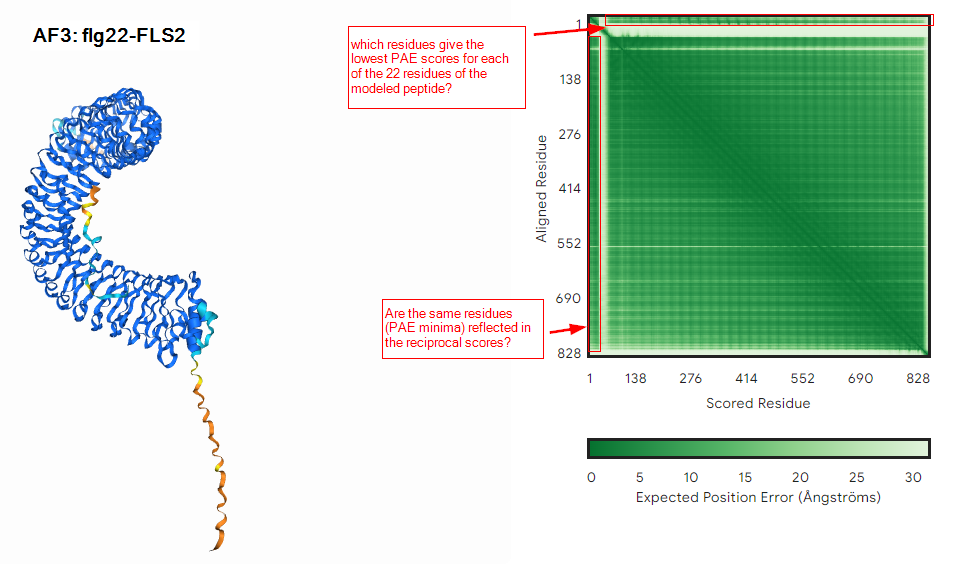
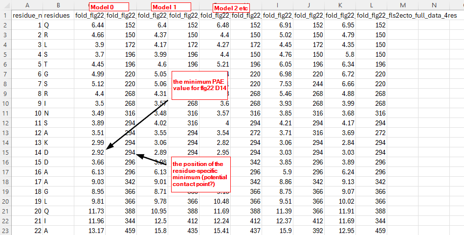

# AF3-PAE-viewer
 A script to visualize PAE minima for specific residues in AF3 json data

## The problem
The folder "example data" contains .json files with PAE matrices for a two protein AlphaFold3 run.

We often want to model peptide interactions with receptors, for example:
```
>flg22
QRLSTGSRINSAKDDAAGLQIA
>FLS2-ectodomain
MKLLSKTFLILTLTFFFFGIALAKQSFEPEIEALKSFKNGISNDPLGVLSDWTIIGSLRHCNWTGITCDSTGHVVSVSLLEKQLEGVLSPAIANLTYLQVLDLTSNSFTGKIPAEIGKLTELNQLILYLNYFSGSIPSGIWELKNIFYLDLRNNLLSGDVPEEICKTSSLVLIGFDYNNLTGKIPECLGDLVHLQMFVAAGNHLTGSIPVSIGTLANLTDLDLSGNQLTGKIPRDFGNLLNLQSLVLTENLLEGDIPAEIGNCSSLVQLELYDNQLTGKIPAELGNLVQLQALRIYKNKLTSSIPSSLFRLTQLTHLGLSENHLVGPISEEIGFLESLEVLTLHSNNFTGEFPQSITNLRNLTVLTVGFNNISGELPADLGLLTNLRNLSAHDNLLTGPIPSSISNCTGLKLLDLSHNQMTGEIPRGFGRMNLTFISIGRNHFTGEIPDDIFNCSNLETLSVADNNLTGTLKPLIGKLQKLRILQVSYNSLTGPIPREIGNLKDLNILYLHSNGFTGRIPREMSNLTLLQGLRMYSNDLEGPIPEEMFDMKLLSVLDLSNNKFSGQIPALFSKLESLTYLSLQGNKFNGSIPASLKSLSLLNTFDISDNLLTGTIPGELLASLKNMQLYLNFSNNLLTGTIPKELGKLEMVQEIDLSNNLFSGSIPRSLQACKNVFTLDFSQNNLSGHIPDEVFQGMDMIISLNLSRNSFSGEIPQSFGNMTHLVSLDLSSNNLTGEIPESLANLSTLKHLKLASNNLKGHVPESGVFKNINASDLMGNTDLCGSKKPLKPCTIKQKSSHFSKRTR
```

However, the default PAE viewer for Alphafold is not very informative


This script is a starting point to quickly analyze PAE minima and compare AF3 models.

## Usage

Call the plot_PAE.py script with the following 3 arguments:

  **folder**      folder containing json files to analyze
  
  **peptide**     sequence in amino acids of the N-terminal peptide
  
  **residues**    residues to plot individually
  
Since we are particularly interested in Asp14 and Asp15 as a FLS contact point, we specify in the example below to graph PAE by residue specificically for residues 14 and 15

```
python plot_PAE.py /path/to/example_data QRLSTGSRINSAKDDAAGLQIA 14 15 
```

The script will create a subdirectory "PAE-QRLSTGSRINSAKDDAAGLQIA_14_15" and populate the folder with pdf and csv files for each json file in the originally specified directory. 

Most importantly, it will create the following analyses allowing comparison of output models:

## 1. combined_plots.pdf 


## 2. combined_pae_minima.csv and combined_reciprocal_pae.csv

